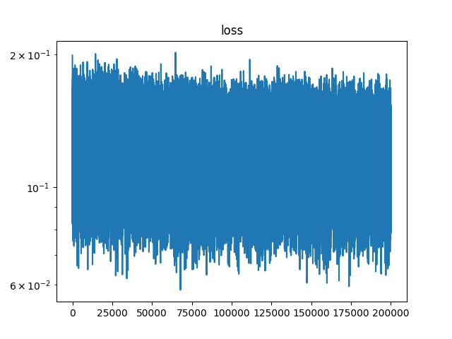

# KAN-VS-MLP
This repo provides some examples (mostly solving PDE) to compare KAN and MLP.

## Env

### Installation KAN

Please refer to the repo of [KAN](https://github.com/KindXiaoming/pykan) for installation.

## Examples

### High-Frequency Problems

#### 1D Harmonics Oscillator

##### Command

```python
python 1d_harmonics_oscillator.py {--model_type} {--n_layers} {--hidden_dim} {--d} {--w0} {--n_mesh} {--pde_sample} {--n_step} {--lr}
```

* `--model_type`: `mlp` or `kan`, default is `mlp`
* `--n_layers`: number of hidden layers, default is `2`
* `--hidden_dim`: hidden dimension, default is `5`
* `--d`: parameter of PDE, default is `2`
* `--w0`: parameter of PDE, default is `10`
* `--n_mesh`: number of testing points, default is `1000`
* `--pde_sample`: number of training points, default is `100`
* `--n_step`: number of training steps, default is `10000`
* `--lr`: learning rate, default is `1e-2`

##### output

* `./output/1d_harmonics_oscillator_{model_type}_{d}_{w0}_{n_layers}_{hidden_dim}_pred.png`: prediction of the model
* `./output/1d_harmonics_oscillator_{model_type}_{d}_{w0}_{n_layers}_{hidden_dim}_l2_loss.png`: loss curve (l2 loss of mesh points) of the model
* `./output/1d_harmonics_oscillator_{model_type}_{d}_{w0}_{n_layers}_{hidden_dim}.log`: log file

##### Example Command

* `d=2, w0=10, n_layers=2, hidden_dim=5` with same computational resource (similar wall time)

```python
python 1d_harmonics_oscillator.py --model_type mlp --n_step 200000
```

```python
python 1d_harmonics_oscillator.py --model_type kan --n_step 10000
```

|Type| L2 Loss (last step) | Prediction                                                                                           | L2 Loss Curve                                                                                              |
|---|---------------------|---|------------------------------------------------------------------------------------------------------------|
|MLP| 1.9500e-07          |  |  |
|KAN| 3.8501e-09          |  |  |


* `d=2, w0=50, n_layers=2, hidden_dim=5` with same computational resource (similar wall time)

```python
python 1d_harmonics_oscillator.py --model_type mlp --n_step 200000 --w0 50
```

```python
python 1d_harmonics_oscillator.py --model_type kan --n_step 10000 --w0 50
```

|Type| L2 Loss (last step) | Prediction                                                                                           | L2 Loss Curve                                                                                              |
|---|---------------------|------------------------------------------------------------------------------------------------------|------------------------------------------------------------------------------------------------------------|
|MLP| 6.3787e-02          |  |  |
|KAN| 5.3845e-02          |  |  |


* `d=2, w0=100, n_layers=2, hidden_dim=5` with same computational resource (similar wall time)

```python
python 1d_harmonics_oscillator.py --model_type mlp --n_step 200000 --w0 100
```

```python
python 1d_harmonics_oscillator.py --model_type kan --n_step 10000 --w0 100
```

|Type| L2 Loss (last step) | Prediction                                                                                             | L2 Loss Curve                                                                                                |
|---|---------------------|--------------------------------------------------------------------------------------------------------|--------------------------------------------------------------------------------------------------------------|
|MLP| 1.0739e-01          |  |  |
|KAN| 1.1652e-01          |  |  |

